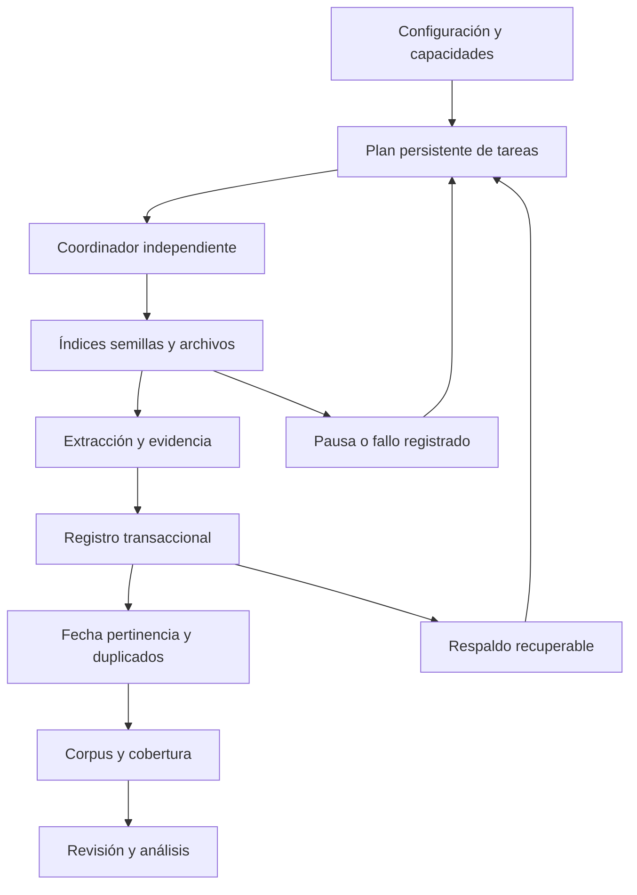

# Arquitectura de SIAN

SIAN reúne evidencia pública en un corpus común con procedencias, versiones y revisiones. La versión de ejecución 3 separa la página, el coordinador, los lectores, la política de selección y el análisis. El contrato de registros permanece en versión 2. La especificación operativa completa está en [RECOLECCION_HISTORICA.md](RECOLECCION_HISTORICA.md).

## Recorrido de la información

## Responsabilidades

| Subsistema | Archivos |
|---|---|
| Configuración y visualización | `streamlit_app.py` |
| Capacidades y planificación histórica | `historical_sources.py` |
| Ejecución independiente y tareas | `collection_jobs.py`, `collection_runner.py`, `process_lock.py` |
| Lectores y control de fuentes | `news_spider.py`, `source_adapters.py`, `source_control.py`, `source_profiles.py` |
| Selección operativa y cobertura | `collection_policy.py` |
| Identidad evidencia y versiones | `corpus_contract.py`, `record_schema.py`, `evidence_model.py` |
| Guardado importación y respaldo | `corpus_storage.py`, `web_corpus_io.py`, `job_backup.py` |
| Corpus guardados y revisión | `corpus_pipeline.py`, `reclean_outputs.py` |
| Modelos descriptivos y estructura narrativa | `narrative_analysis.py`, `structural_narrative.py` |
| Comandos reproducibles | `scripts/collect_historical.py`, demás utilidades de corpus |

## Invariantes

La cuota es total anual, compartida entre capas. Cada identidad cuenta como un documento; copias exactas entre URLs se conservan pero no duplican la cuota. El año solicitado y la fecha de detección nunca sustituyen publicación. Los faltantes y conflictos permanecen. El texto parcial no se presenta como texto completo. Las etiquetas de rubro pueden superponerse y requieren revisión para inferencias sociales.

La página no posee el trabajador: recargarla conserva la ejecución en el mismo servidor. El bloqueo del proceso evita dos trabajadores por base. Los registros se confirman individualmente, los archivos se reemplazan atómicamente y el ZIP contiene una copia consistente de SQLite. Los estados de pausa, interrupción, fuentes pendientes, cuota alcanzada y final con brechas se distinguen explícitamente.

## Persistencia y publicación

El disco predeterminado sigue siendo local. Un volumen configurado mediante `SIAN_DATA_DIR`, un respaldo privado S3 opcional o un ZIP conservado por la persona permiten recuperación después de perder el servidor. La app no aprovisiona infraestructura ni guarda datos automáticamente en la computadora del usuario.

GitHub contiene código, semillas curadas y documentación. Corpus descargados, cachés, bases de ejecución y credenciales quedan excluidos. Actualizar GitHub no produce nuevos datos ni acredita que se haya alcanzado una cuota. Los informes históricos conservan su fecha y límites.

Los archivos de criterios de revisión del proyecto son documentación, no trabajadores autónomos. La interpretación de actores, posturas, relaciones y causalidad sigue requiriendo lectura humana y respaldo literal, conforme a [EVIDENCIA_Y_MODELOS.md](EVIDENCIA_Y_MODELOS.md).
